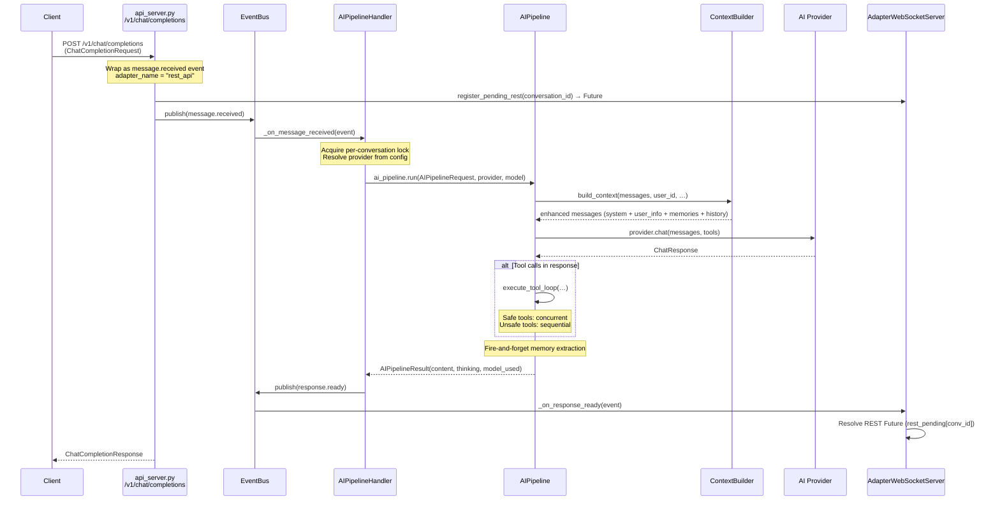
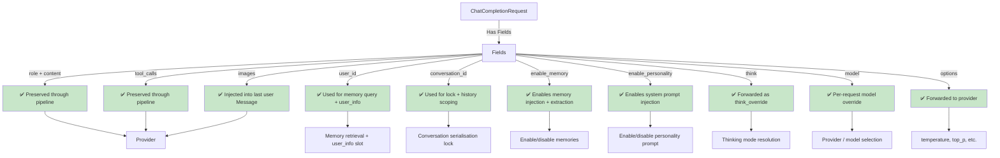
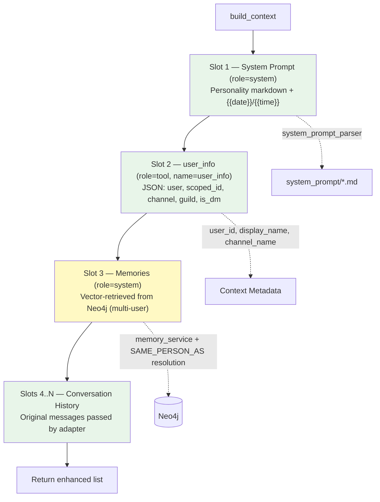

# Message Flow Diagrams

## REST API Request Flow

```mermaid
sequenceDiagram
    participant Client
    participant API as api_server.py<br/>/v1/chat/completions
    participant EB as EventBus
    participant PH as AIPipelineHandler
    participant AP as AIPipeline
    participant CB as ContextBuilder
    participant Provider as AI Provider
    participant WS as AdapterWebSocketServer

    Client->>API: POST /v1/chat/completions<br/>(ChatCompletionRequest)

    Note over API: Wrap as message.received event<br/>adapter_name = "rest_api"

    API->>WS: register_pending_rest(conversation_id) → Future
    API->>EB: publish(message.received)

    EB->>PH: _on_message_received(event)

    Note over PH: Acquire per-conversation lock<br/>Resolve provider from config

    PH->>AP: ai_pipeline.run(AIPipelineRequest, provider, model)

    AP->>CB: build_context(messages, user_id, …)
    CB-->>AP: enhanced messages (system + user_info + memories + history)

    AP->>Provider: provider.chat(messages, tools)
    Provider-->>AP: ChatResponse

    alt Tool calls in response
        AP->>AP: execute_tool_loop(…)
        Note over AP: Safe tools: concurrent<br/>Unsafe tools: sequential
    end

    Note over AP: Fire-and-forget memory extraction

    AP-->>PH: AIPipelineResult(content, thinking, model_used)

    PH->>EB: publish(response.ready)
    EB->>WS: _on_response_ready(event)
    WS->>WS: Resolve REST Future (rest_pending[conv_id])

    API-->>Client: ChatCompletionResponse
```

## Data Transformation Pipeline

```mermaid
graph LR
    A[APIMessage] -->|history list| B[dict in event data]
    B -->|AIPipelineRequest.messages| C[dict list]
    C -->|ContextBuilder| D[enhanced dict list]
    D -->|_to_provider_messages| E[Message objects]
    E -->|normalize_messages| F[Provider dicts]
    F -->|Provider API| G[AI Model]
    G -->|Response| H[ChatResponse]
    H -->|AIPipelineResult| I[response.ready event]
    I -->|REST / WS| J[ChatCompletionResponse]

    style A fill:#e1f5ff
    style C fill:#e1ffe1
    style E fill:#ffe1f5
    style H fill:#c8e6c9
    style J fill:#e1f5ff
```

## ChatCompletionRequest Field Journey

```mermaid
graph TD
    Start[ChatCompletionRequest] -->|Has Fields| Fields

    Fields -->|role + content| F1[✅ Preserved through pipeline]
    Fields -->|tool_calls| F2[✅ Preserved through pipeline]
    Fields -->|images| F3[✅ Injected into last user Message]
    Fields -->|user_id| F4[✅ Used for memory query + user_info]
    Fields -->|conversation_id| F5[✅ Used for lock + history scoping]
    Fields -->|enable_memory| F6[✅ Enables memory injection + extraction]
    Fields -->|enable_personality| F7[✅ Enables system prompt injection]
    Fields -->|think| F8[✅ Forwarded as think_override]
    Fields -->|model| F9[✅ Per-request model override]
    Fields -->|options| F10[✅ Forwarded to provider]

    F1 --> Provider
    F2 --> Provider
    F3 --> Provider
    F4 --> MemoryQuery[Memory retrieval + user_info slot]
    F5 --> ConvLock[Conversation serialisation lock]
    F6 --> Decision1[Enable/disable memories]
    F7 --> Decision2[Enable/disable personality prompt]
    F8 --> Think[Thinking mode resolution]
    F9 --> ModelRes[Provider / model selection]
    F10 --> ProvOpts[temperature, top_p, etc.]

    style F1 fill:#c8e6c9
    style F2 fill:#c8e6c9
    style F3 fill:#c8e6c9
    style F4 fill:#c8e6c9
    style F5 fill:#c8e6c9
    style F6 fill:#c8e6c9
    style F7 fill:#c8e6c9
    style F8 fill:#c8e6c9
    style F9 fill:#c8e6c9
    style F10 fill:#c8e6c9
```

## Context Building Order

```mermaid
graph TB
    Start[build_context] --> P1

    P1["Slot 1 — System Prompt (role=system)<br/>Personality markdown + {{date}}/{{time}}"] --> P2
    P2["Slot 2 — user_info (role=tool, name=user_info)<br/>JSON: user, scoped_id, channel, guild, is_dm"] --> P3
    P3["Slot 3 — Memories (role=system)<br/>Vector-retrieved from Neo4j (multi-user)"] --> P4
    P4["Slots 4..N — Conversation History<br/>Original messages passed by adapter"] --> End[Return enhanced list]

    P1 -.->|system_prompt_parser| SP[system_prompt/*.md]
    P2 -.->|user_id, display_name, channel_name| Meta[Context Metadata]
    P3 -.->|memory_service + SAME_PERSON_AS resolution| MDB[(Neo4j)]

    style P1 fill:#e8f5e9
    style P2 fill:#e8f5e9
    style P3 fill:#fff9c4
    style P4 fill:#e8f5e9
```
