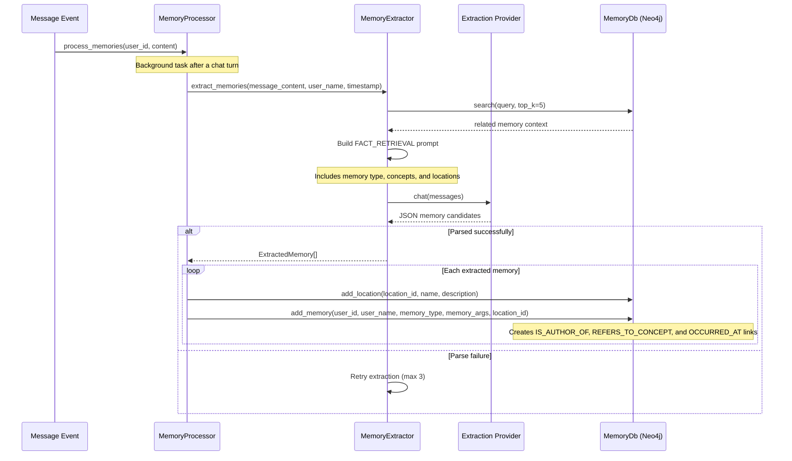
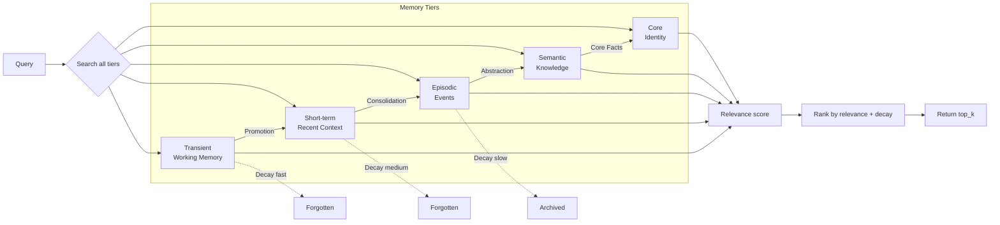
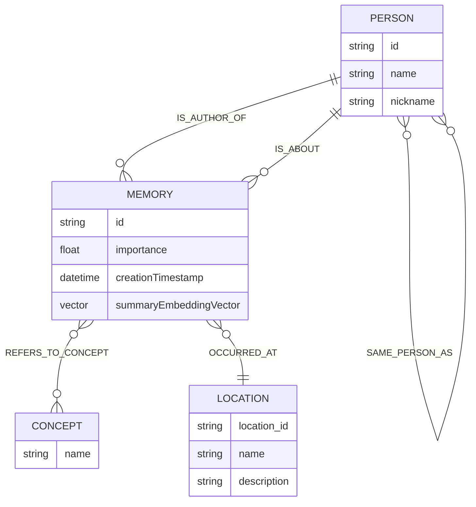
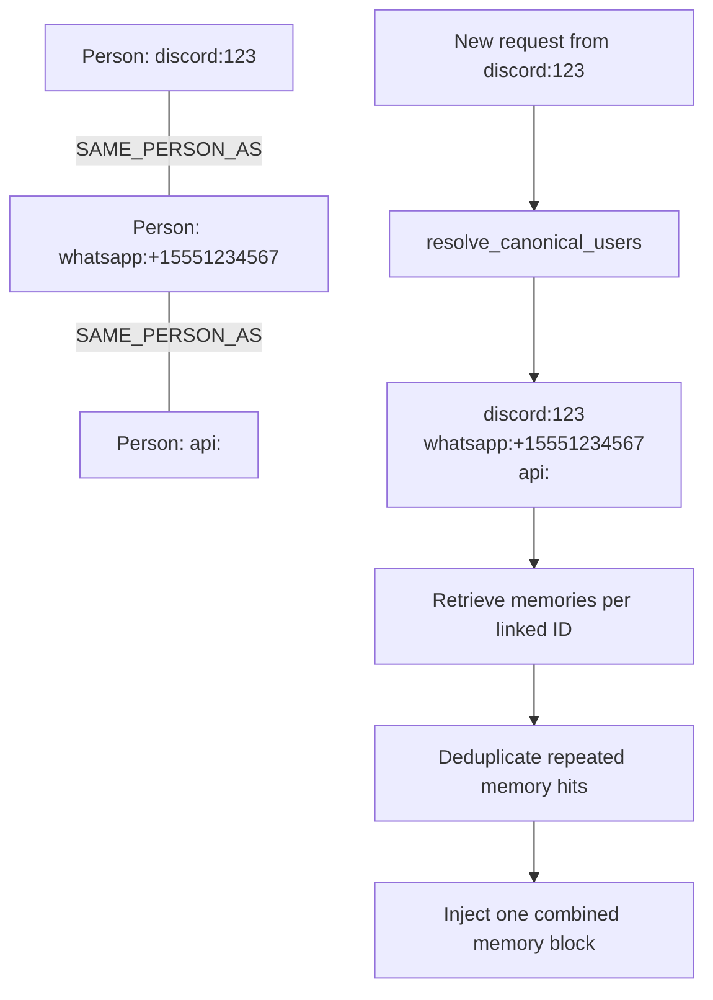
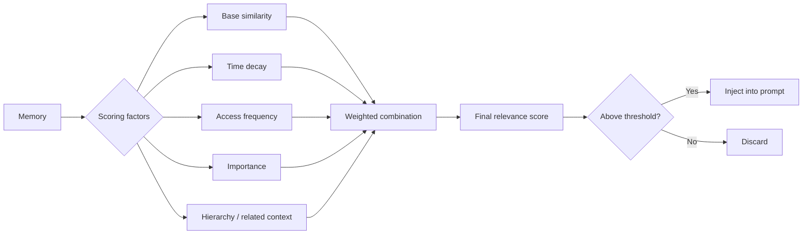

# Memory System Flow Diagrams

## Memory Extraction Pipeline



## Memory Retrieval Flow

```mermaid
graph TB
    Start[Context Builder] --> System[Add system prompt]
    System --> UserInfo[Add user_info tool message (slot 2)]
    UserInfo --> Query[Get last user message]
    Query --> Resolve[Resolve canonical identities<br/>resolve_canonical_users(user_id)]
    Resolve --> Multi[MemoryService.get_formatted_memories_multi_user]
    Multi --> Search[Retrieve memories for each linked scoped ID]
    Search --> Dedupe[Deduplicate by memory_id]
    Dedupe --> Format[Format memories as one system block]
    Format --> Prompt[Return enhanced prompt to provider]
```

## Memory Hierarchy System



## Memory Data Model



## Cross-Platform Identity Resolution



## Memory Decay Scoring


