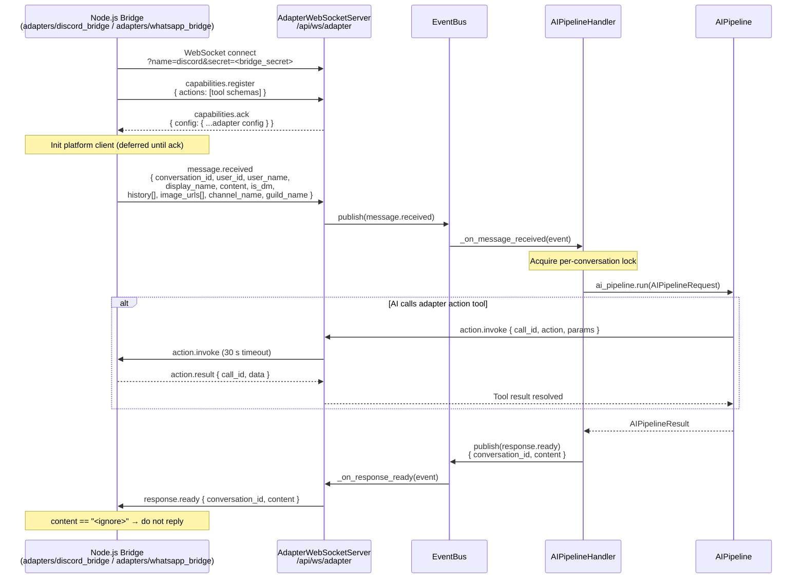
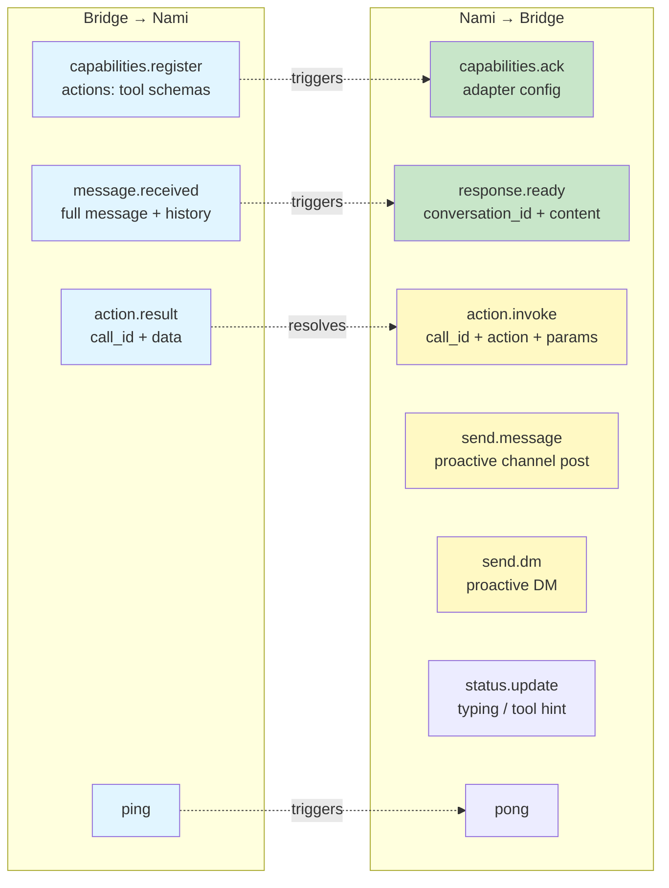
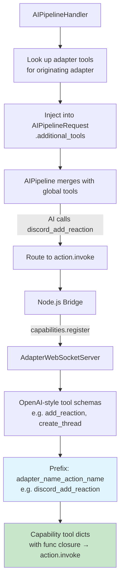
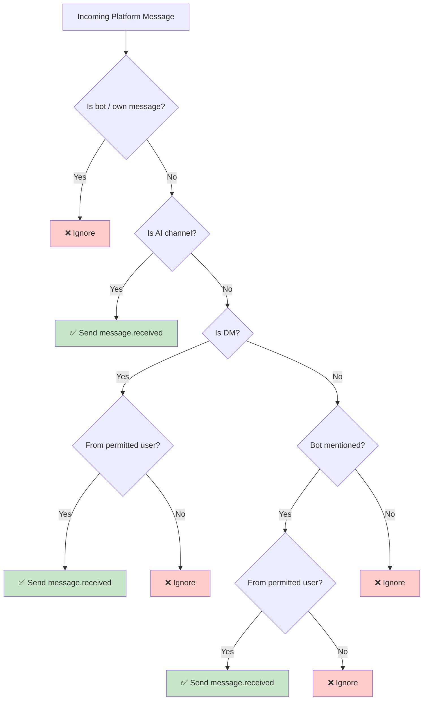
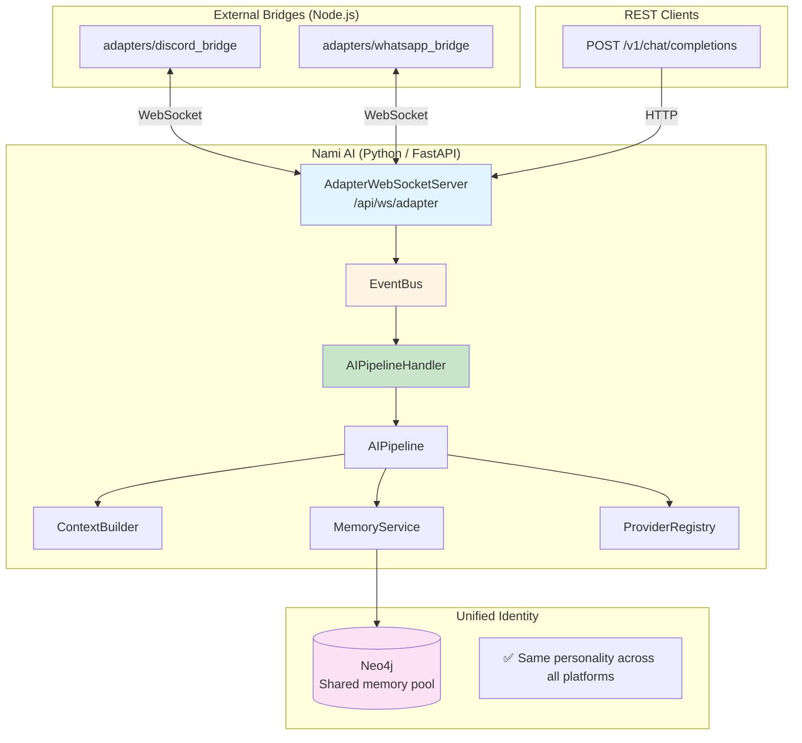
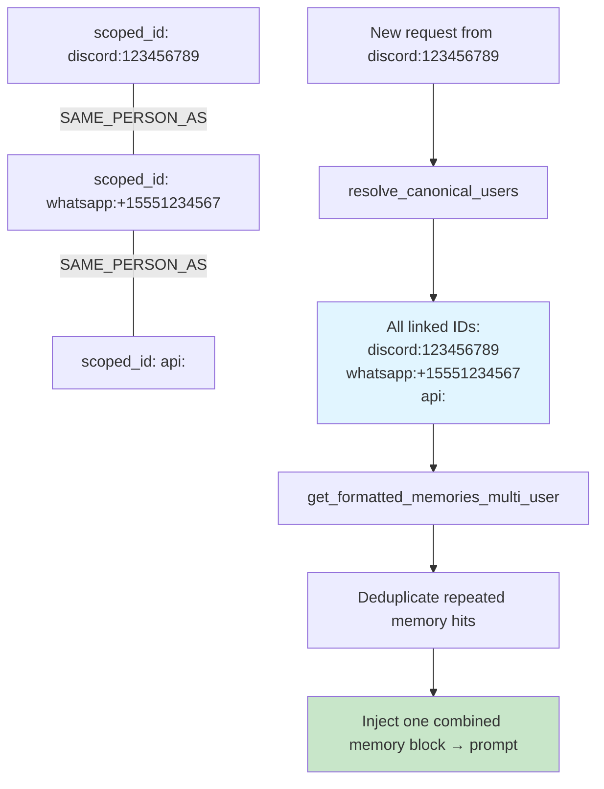

# Chat Adapter Flow Diagrams

## External Adapter Message Flow (WebSocket Protocol)

External chat adapters (Discord, WhatsApp, etc.) are independent Node.js services
that connect to Nami via a persistent WebSocket. All message routing is event-driven.



## WebSocket Event Protocol



## Capability / Adapter Tool System



## Response Handling in Bridges

```mermaid
graph TB
    WS[response.ready event] --> Bridge[Node.js Bridge receives content]
    Bridge --> Ignore{content == "&lt;ignore&gt;"?}

    Ignore -->|Yes| Drop[Do not reply]
    Ignore -->|No| Length{Length check}

    Length -->|≤ 2000 chars| Single[Send single message]
    Length -->|> 2000 chars| Chunk[Split and send chunks]

    Chunk --> Typing[Show typing indicator]
    Typing --> Send[Send each chunk]

    style Drop fill:#ffcccc
    style Single fill:#c8e6c9
    style Send fill:#c8e6c9
```

## Adapter Decision Logic (Bridge-side)



## Unified Architecture Overview



## Cross-Platform Identity


