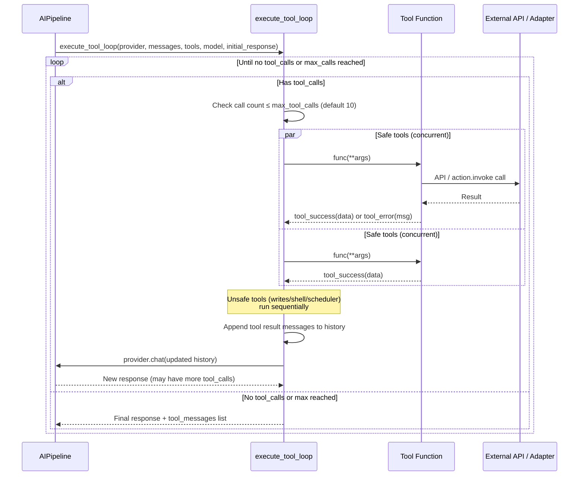
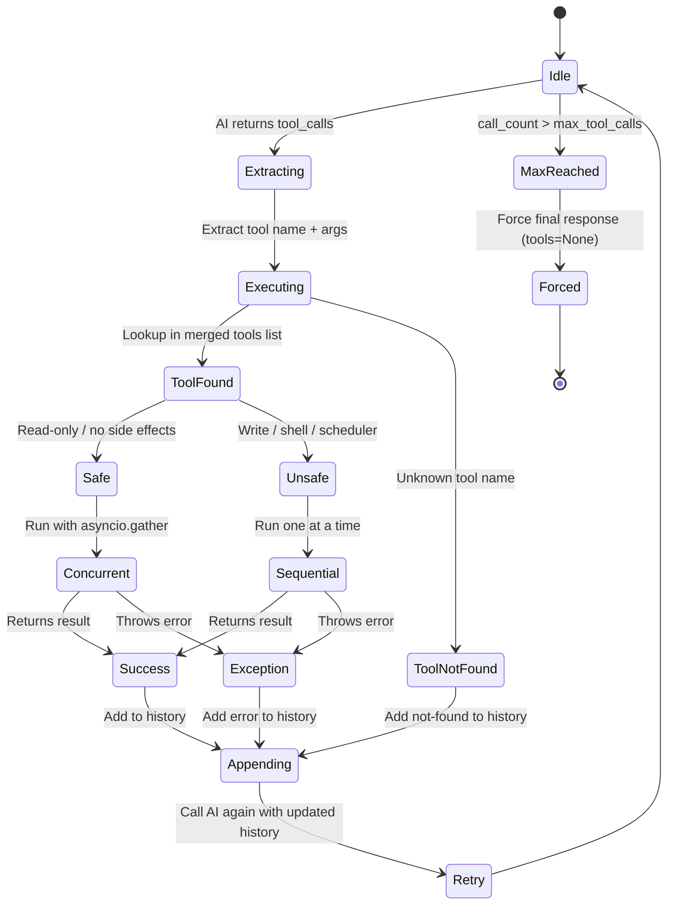
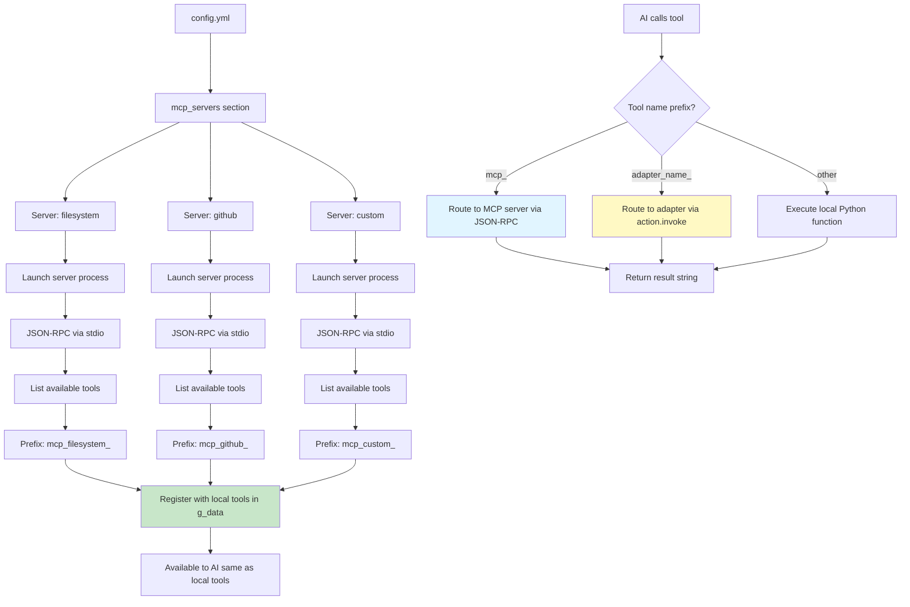
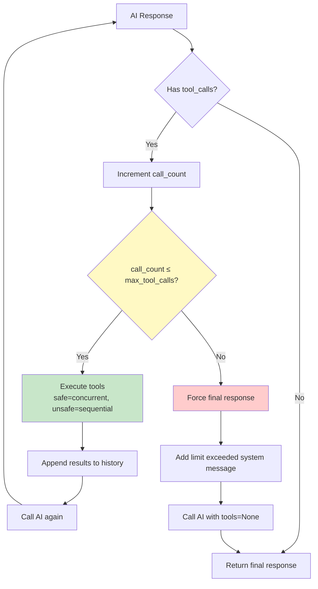

# Tool Execution Flow Diagrams

## Tool Call Loop (inside AIPipeline)



## Tool Registration and Loading

```mermaid
graph TB
    Start[Application Startup] --> TL[ToolLoader / tool_context]

    TL --> Scan[Scan OllamaTools/]
    Scan --> Files[Find *.py files]

    Files --> Load{For each file}

    Load --> Import[Import module]
    Import --> Check{Has get_tool?}

    Check -->|Yes| Call[Call get_tool()]
    Check -->|No| Skip1[Skip file]

    Call --> Schema[Returns tool schema dict]
    Schema --> Extract[Extract components]

    Extract --> C1[type: function]
    Extract --> C2[function: OpenAI-style schema]
    Extract --> C3[func: async callable]

    C1 --> Register[Register in g_data tools list]
    C2 --> Register
    C3 --> Register

    Register --> More{More files?}
    More -->|Yes| Load
    More -->|No| MCP[Load MCP tools via mcp_loader]

    MCP --> Remote[Connect to MCP servers]
    Remote --> Prefix[Prefix: mcp_servername_toolname]
    Prefix --> Register2[Register alongside local tools]

    Register2 --> Caps[Adapter capability tools registered<br/>per connection via AdapterWebSocketServer]

    Caps --> Ready[All tools available to AI]

    style Register fill:#c8e6c9
    style Register2 fill:#e1f5ff
    style Caps fill:#fff9c4
```

## Tool Execution States



## MCP Tool Integration



## Tool Call Limit Guard


