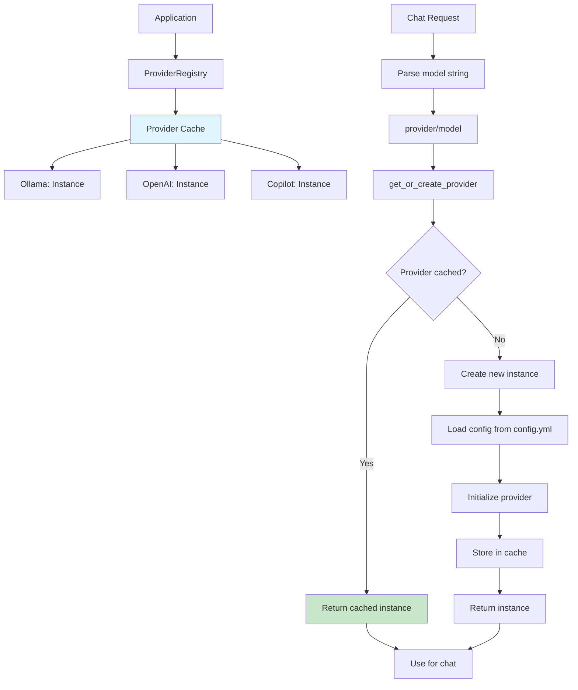
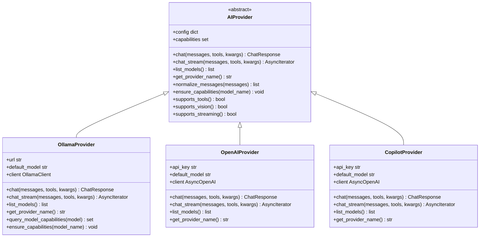
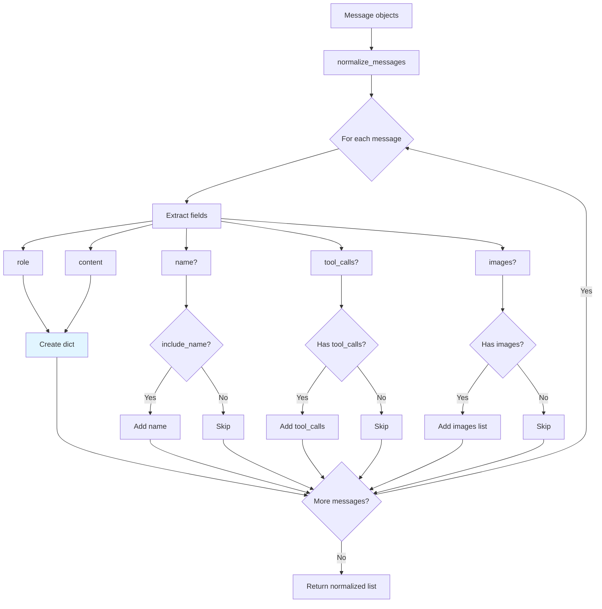
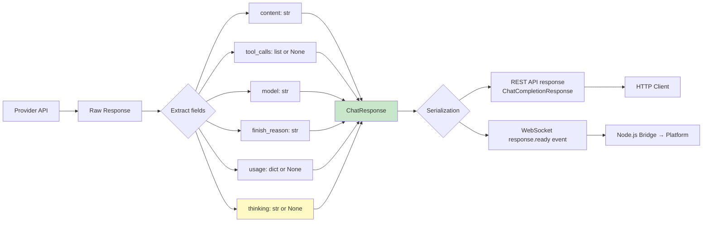

# AI Provider Architecture Diagrams

## Provider Registry Pattern



## Provider Inheritance Hierarchy



## Thinking Mode Resolution

```mermaid
graph TB
    Input[incoming message + config] --> Resolve[resolve_thinking_mode]

    Resolve --> Override{think_override set?}
    Override -->|True| UseThink[Use thinking model]
    Override -->|False| NoThink[Skip thinking]
    Override -->|None auto| Trigger{Trigger words in message?}

    Trigger -->|Yes| UseThink
    Trigger -->|No| NoThink

    UseThink --> Model{thinking_model configured?}
    Model -->|Yes| Switch[Switch to thinking model]
    Model -->|No| Same[Keep default model]

    Switch --> Chat[provider.chat(model=thinking_model, think=True)]
    Same --> Chat2[provider.chat(model=default, think=True)]
    NoThink --> Chat3[provider.chat(model=default)]

    Chat --> Response[ChatResponse with thinking field]
    Chat2 --> Response
    Chat3 --> Response2[ChatResponse no thinking]

    style UseThink fill:#fff9c4
    style Switch fill:#e1f5ff
```

## Message Normalization Flow



## ChatResponse Data Flow


