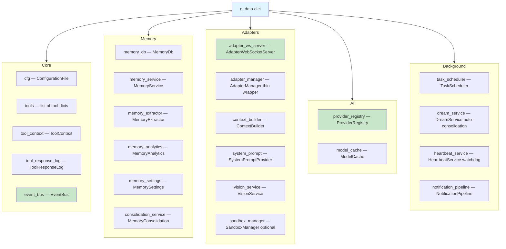
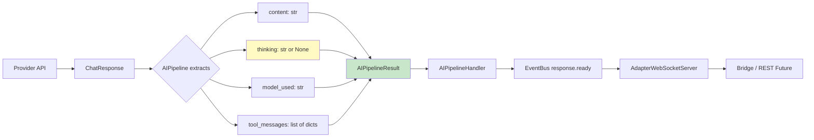

# Data Structure Reference Diagrams

## Message Format Comparison

```mermaid
graph TB
    subgraph "REST API Layer — ChatCompletionRequest"
        OM[APIMessage]
        OM --> OM1[role: str]
        OM --> OM2[content: str]
        OM --> OM3[images: list or None]
        OM --> OM4[tool_calls: list or None]
        OM --> OM5[thinking: str or None]
    end

    subgraph "EventBus Event Data (message.received)"
        EV[event.data dict]
        EV --> EV1[adapter_name: str]
        EV --> EV2[conversation_id: str]
        EV --> EV3[user_id: str]
        EV --> EV4[content: str]
        EV --> EV5[history: list of dicts]
        EV --> EV6[image_urls: list]
        EV --> EV7[display_name: str]
        EV --> EV8[channel_name: str]
        EV --> EV9[guild_name: str]
        EV --> EV10[is_dm: bool]
    end

    subgraph "Internal Pipeline — AIPipelineRequest"
        PR[AIPipelineRequest]
        PR --> PR1[messages: list of dicts]
        PR --> PR2[user_id: str or None]
        PR --> PR3[conversation_id: str or None]
        PR --> PR4[image_urls: list]
        PR --> PR5[enable_memory: bool]
        PR --> PR6[enable_personality: bool]
        PR --> PR7[think_override: bool or None]
        PR --> PR8[additional_tools: list or None]
        PR --> PR9[display_name: str or None]
        PR --> PR10[channel_name: str or None]
        PR --> PR11[guild_name: str or None]
        PR --> PR12[is_dm: bool]
    end

    subgraph "Provider Layer — Message"
        M[Message]
        M --> M1[role: str]
        M --> M2[content: str]
        M --> M3[name: str or None]
        M --> M4[tool_calls: list or None]
        M --> M5[images: list or None]
        M --> M6[tool_call_id: str or None]
    end

    OM -.->|history list in event| EV5
    EV -.->|AIPipelineHandler builds| PR
    PR -.->|_to_provider_messages| M

    style OM fill:#e1f5ff
    style EV fill:#fff4e1
    style PR fill:#c8e6c9
    style M fill:#ffe1f5
```

## Global Registry (g_data) Structure

```mermaid
graph TB
    Registry[g_data dict] --> Core
    Registry --> Memory
    Registry --> Adapters
    Registry --> AI
    Registry --> Background

    subgraph Core
        S1[cfg — ConfigurationFile]
        S2[tools — list of tool dicts]
        S3[tool_context — ToolContext]
        S4[tool_response_log — ToolResponseLog]
        S5[event_bus — EventBus]
    end

    subgraph Memory
        M1[memory_db — MemoryDb]
        M2[memory_service — MemoryService]
        M3[memory_extractor — MemoryExtractor]
        M4[memory_analytics — MemoryAnalytics]
        M5[memory_settings — MemorySettings]
        M6[consolidation_service — MemoryConsolidation]
    end

    subgraph Adapters
        A1[adapter_ws_server — AdapterWebSocketServer]
        A2[adapter_manager — AdapterManager thin wrapper]
        A3[context_builder — ContextBuilder]
        A4[system_prompt — SystemPromptProvider]
        A5[vision_service — VisionService]
        A6[sandbox_manager — SandboxManager optional]
    end

    subgraph AI
        AI1[provider_registry — ProviderRegistry]
        AI2[model_cache — ModelCache]
    end

    subgraph Background
        B1[task_scheduler — TaskScheduler]
        B2[dream_service — DreamService auto-consolidation]
        B3[heartbeat_service — HeartbeatService watchdog]
        B4[notification_pipeline — NotificationPipeline]
    end

    style Registry fill:#e1f5ff
    style AI1 fill:#c8e6c9
    style A1 fill:#c8e6c9
    style S5 fill:#c8e6c9
```

## AIPipelineResult Fields

```mermaid
graph LR
    Provider[Provider API] --> Raw[ChatResponse]

    Raw --> Extract{AIPipeline extracts}

    Extract --> Content[content: str]
    Extract --> Thinking[thinking: str or None]
    Extract --> Model[model_used: str]
    Extract --> ToolMsgs[tool_messages: list of dicts]

    Content --> Result[AIPipelineResult]
    Thinking --> Result
    Model --> Result
    ToolMsgs --> Result

    Result --> PH[AIPipelineHandler]
    PH --> EB[EventBus response.ready]
    EB --> WS[AdapterWebSocketServer]
    WS --> Bridge[Bridge / REST Future]

    style Result fill:#c8e6c9
    style Thinking fill:#fff9c4
```
